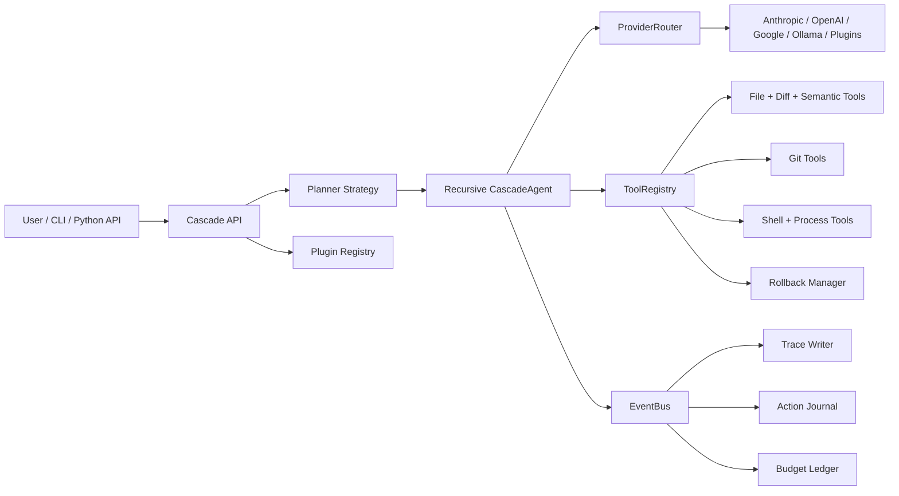

# Architecture

Cascade is a multi-model software engineering runtime built around a small number of explicit contracts: providers, tools, strategies, execution events, and task results.

## System Diagram

## Typical Task Flow

1. `Cascade.run()` or `Cascade.run_async()` loads config, tools, providers, and the active strategy.
2. The strategy creates an `ExecutionContext`, starts the budget ledger entry, and subscribes tracing and journaling to the event bus.
3. The root `CascadeAgent` inspects the repo with discovery tools, builds working memory, and chooses between direct execution and delegation.
4. Tool calls are routed through `ToolRegistry`, which handles approval checks, dry runs, cache hits, rollback snapshots, and structured tool result events.
5. Model calls are routed through `ProviderRouter`, which applies prompt-budget checks and fallback behavior before invoking the underlying provider.
6. Execution events are written to `.cascade/traces/<task-id>/`, journaled to `.cascade/journal.log`, and attributed in the budget ledger.
7. The strategy returns a stable `TaskResult`, preserving the public API contract.

## Major Design Decisions

### Reflection-Retry-Escalate

Instead of naive retries, agents capture a `RetryReflection` that explains what failed, what evidence exists, and how the next attempt should change. This keeps retries purposeful and creates a clear escalation trail.

### Working Memory

Chat history alone is a weak substrate for long-running software tasks. Cascade uses `WorkingMemory` to track the goal, constraints, completed subgoals, blockers, and recent tool results in a structured way.

### Unified Provider Interface

The core runtime talks only to `BaseProvider` and `ProviderRouter`. Provider-specific quirks stay at the edges so fallback, streaming, and benchmarking logic remain shared.

### Event-First Observability

The event bus is the single source for traces, journal entries, live status, and future dashboard support. This avoids duplicating side effects in multiple layers.

### Tool Manifests and Dry Runs

Tools declare their capabilities and mutability, and mutating tools provide dry-run output. The approval system uses those previews so user consent is informed instead of theatrical.
